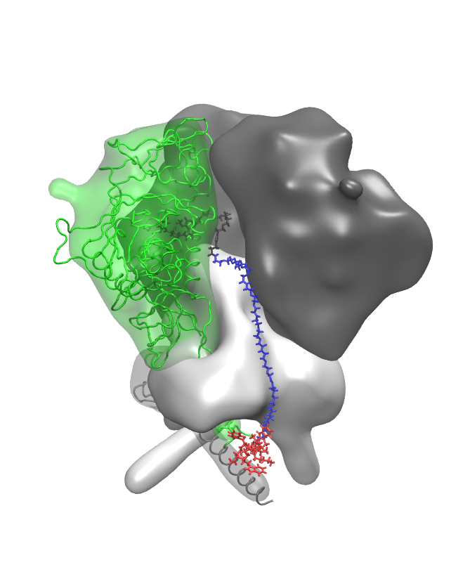

# 5U7O -- SOSIP trimer with glycans and a DAVEI modeled-in

## Files

This directory contains five files:
1. mkpsf_5u7o.tcl -- the VMD/psfgen script that creates the first vacuum psf/pdb pair.  It uses a monte-carlo-based loop model-builder to build in missing residues.  It includes all glycans present in the PDB entry.  Symmetry replication is peformed by aligning the gp120/gp41 alpha carbons to the 4ZMJ structure and then using the BIOMT transformations in 4ZMJ (since 5U7O has none!) to generate the full trimer.
2. my_5u7o_vac.namd -- NAMD configuration file used to relax the "guessed" coordinates resulting from mkpsf_5u7o.tcl.
3. my_5u7o_solv.tcl -- VMD script that uses `solvate` and `autoionize` to generate a neutralized, solvated MD system using the coordinates from step 2 as input.  This also generates my_5u7o_colvars_op.inp, a colvars input file that defines collective variables that allow for center-of-mass restraint and an orientational restraint to keep the C3v axis along z.  (Colvars restraints are NOT recommended for production MD.)
4. my_5u7o_solv_stageN.namd -- NAMD configuration file template for performing a minimization and short NpT MD of the raw solvated system to equilibrate the box volume; uses colvars module input file from 4.
5. do_test.sh -- a bash script that does everything

## Instructions

If you have cloned this repository, then make sure PSFGEN_BASEDIR resolves to the root directory of your local copy.  If you did not
clone the repository, you will have to figure this part out on your own.  It is also assumed below that CHARMRUN resolves to your local charmrun executable and NAMD2 resolves to your local NAMD2 executable.  For me, these are /home/cfa/namd/NAMD_2.12_Source/Linux-x86_64-g++/charmrun and /home/cfa/namd/NAMD_2.12_Source/Linux-x86_64-g++/namd2.

To create the system, just invoke the do_test script in a clean directory:

```
$ mkdir 5u7o-davei-l7
$ cd 5u7o-davei-l7
$ $PSFGEN_BASEDIR/5u7o/do_test.sh [-psfgen_args [+protomer] [-seed #] [-mper-extend] [-tm-extend] [-log-dcd <filename.dcd>] [-attractor-radius #]]
```
where the optional `-psfgen_args` flag is followed by arguments passed to the `psfgen` script:  `+protomer`, if present, directs the script to generate a single protomer instead of a 3-fold-symmetric trimer; `-seed` allows the user to specify the seed for the random-number generator; and `-mper-extend`, if present, directs the script to model-in the MPER sequence on each monomer as an alpha-helix.
The `-tm-extend` flag, if present, will grow MPER's _and_ TM's out to 709 as alpha helices.  The `-attractor-radius` switch instructs the script to generate attractors for the stage-2 vacuum steered MD simulations to pull the Trp3's outward from the threefold axis; currently, this position is reference to the alpha-carbon of residue 648 of the protomer to which the DAVEI is bound, and a value of 60 Angstroms is good to use here.

For the base case to generate the image below, I ran this as 
```
~/research/psfgen/5u7o-davei-l7/do_test.sh -seed 2222 -psfgen_args -mper-extend -attractor_radius 60.0 -log-dcd make.dcd
```



The mkpsf script performs several important input-file generation steps for the subsequent three-stage vacuum MD, prior to solvation and explicit-solvent MD.  The three stages of vacuum MD are as follows:

1. Minimization and short equilibration of modeled-in atoms.
2. Steered MD in which the Trp3's are pulled outward and a bit downward to help position them.  This is done using the colvars module in NAMD with `cartesian` colvars on the alpha-carbon of the 9th residue in each Trp3, and these atoms are pulled toward points generated by projecting the alpha-carbon of each residue 648 outward by 60 angstroms.
3. Steered MD in whith the Trp3's are brought into contact with the MPER segment of Env.  The colvars module is again used here, with a `distance` colvar between the Trp3 and the MPER.  Additionally, a special repulsive bias is applied between the Trp3 and the residues 610 to 630 of the gp41 cognate to the gp120 to which the DAVEI's BMS end is bound.  Importantly, the MPER segment to which the Trp3 is attracted is that of the gp41 in the position _counterclockwise_ looking from above the trimer toward putative viral membrane.  _That_ gp41's MPER projects "under" that gp120 making it the closest MPER to the BMS site.

After this set of vacuum MD stages is done, solvation proceeds as usual.

## REMAKE BONDSTRUCT.SO

If you have not done so as of July 27, 2018, you need to remake `bondstruct.so` in the `src` directory.
```
$ cd $PSFGEN_BASEDIR
$ git pull
$ cd src
$ make bondstruct.so
```

2018, Cameron F Abrams
