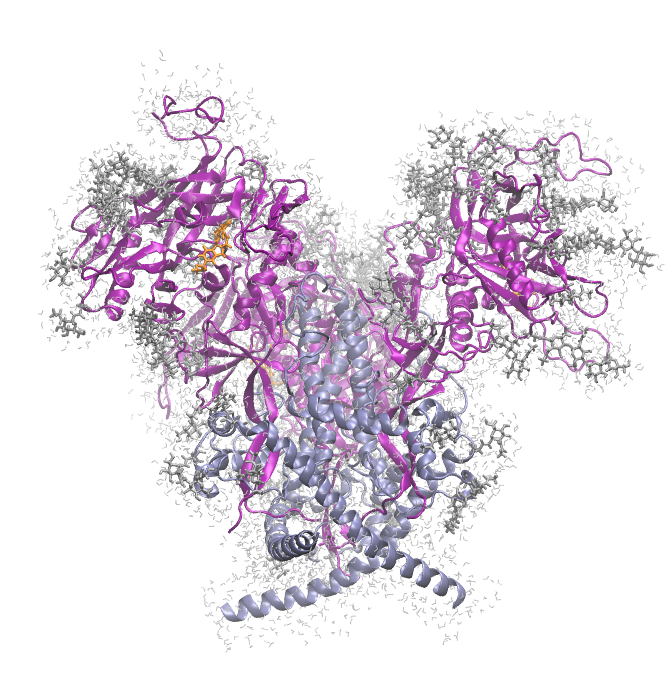

# 5VN3 -- Soluble, cleaved sosip trimer with glycans, CD4-/17b-bound conformation, option for BNM-III-170 docking

## Files

This directory contains five files:
1. mkpsf_5vn3.tcl -- VMD/psfgen script that creates the first vacuum psf/pdb pair.  It uses a monte-carlo-based loop model-builder to build in the missing residues. By choice, we are currently NOT including the sCD4 and 17b chains in the built structure. However, we do build in all the glycans present for the gp120 chains (G, I, J) and gp41 chains (A, B, D).
2. my_5vn3_vac.namd -- NAMD configuration file used to relax the "guessed" coordinates resulting from step 1.
3. my_5vn3_solv.tcl -- VMD script that uses solvate and autoionize to generate a neutralized, solvated MD system using the coordinates from step 2 as input.
4. my_5vn3_colvars_op.inp -- colvars input file that defines collective variables that allow for center-of-mass restraint and an orientational restraint to keep the C3v axis along z.
5. my_5vn3_solv.namd -- NAMD configuration file that performs a minimization and short MD of the raw solvated system; uses colvars module input file from 4.

## Instructions

If you have cloned this repository, then make sure PSFGEN_BASEDIR resolves to the root directory of your local copy.  If you did not
clone the repository, you will have to figure this part out on your own.  It is also assumed below that CHARMRUN resolves to your local charmrun executable and NAMD2 resolves to your local NAMD2 executable.  For me, these are /home/cfa/namd/NAMD_2.12_Source/Linux-x86_64-g++/charmrun and /home/cfa/namd/NAMD_2.12_Source/Linux-x86_64-g++/namd2.

To create the system, just invoke the do_test script in a clean directory:

```
$ mkdir 5vn3
$ cd 5vn3
$ $PSFGEN_BASEDIR/5vn8/do_test.sh [-seed #] [-restart #] [-psfgen_args [-mper-extend] [-log-dcd <filename.dcd>] [-dock-bnm] [-lmct #] [-lmck #] [-lmcr0 #] [-lmcnc #]]
```
The `-seed` flag allows the user to set the random number generator seed.  The optional `-restart` flag allows the user to restart from a failed build (say for instance if the solvated MD failed for some reason); read the `do_test.sh` script to see where the restart levels are.  The optional `-psfgen_args` flag is followed by arguments passed to the `psfgen` script:  `-mper-extend`, if present, directs the script to model-in the MPER sequence on each monomer as an alpha-helix.  The `-dock-bnm` switch instructs the script to include three molecules of the inhibitor BNM-III-170 in the Phe43 pockets based on a binding-pocket residue alignment from the 5F4P HIV-1 gp120 core-monomer/BNM-III-170 co-crystal structure [2]. 

Switches that begin with `-lmc` pertain to the loop-Monte-Carlo: `-lmct`: temperature (2.5); `-lcmk`: attractor-strength (10.0); `-lmcr0`: target bond-length (1.5 A); `-lmcnc`: number of cycles (1000).

For the base case to generate the image below, I ran this as 
```
~/research/psfgen/5vn3/do_test.sh -seed 77101 -psfgen_args -mper-extend -log-dcd make.dcd -dock-bnm -lmct 2.5 -lmck 1.0 -lmr0 2.0
```



Rendering of solvated open HIV-1 Env SOSIP trimer from PDB 5vn3 [1]; gp120's in purple ribbon, gp41's in light blue ribbon, glycans as silver sticks, waters within 3.0 A of protein or glycan in grey, docked BNM-III-170 inhibitors [2] in orange stick.

## REMAKE BONDSTRUCT.SO

If you have not done so as of July 27, 2018, you need to remake `bondstruct.so` in the `src` directory.
```
$ cd $PSFGEN_BASEDIR
$ git pull
$ cd src
$ make bondstruct.so
```

## REFERENCES
1. "Open and closed structures reveal allostery and pliability in the HIV-1 envelope spike."
Ozorowski, G., Pallesen, J., de Val, N., Lyumkis, D., Cottrell, C.A., Torres, J.L., Copps, J., Stanfield, R.L., Cupo, A., Pugach, P., Moore, J.P., Wilson, I.A., Ward, A.B.
(2017) _Nature_ *547*:360-363
2. "Small-Molecule CD4-Mimics: Structure-Based Optimization of HIV-1 Entry Inhibition."
Melillo, B., Liang, S., Park, J., Schon, A., Courter, J.R., LaLonde, J.M., Wendler, D.J., Princiotto, A.M., Seaman, M.S., Freire, E., Sodroski, J., Madani, N., Hendrickson, W.A., Smith, A.B.
(2016) _ACS Med.Chem.Lett._ *7*:330-334

2018, Cameron F Abrams
